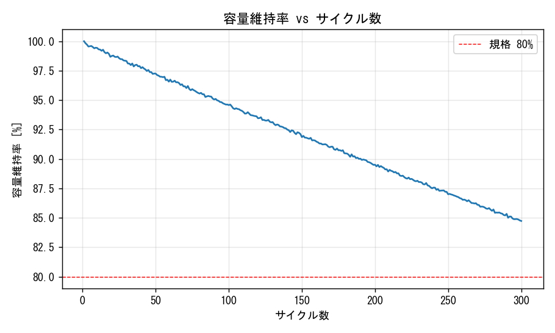
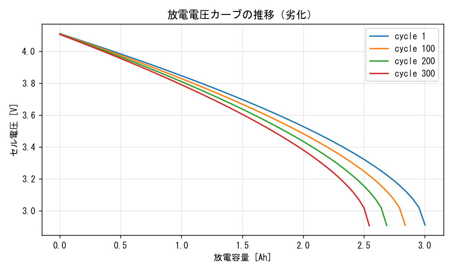
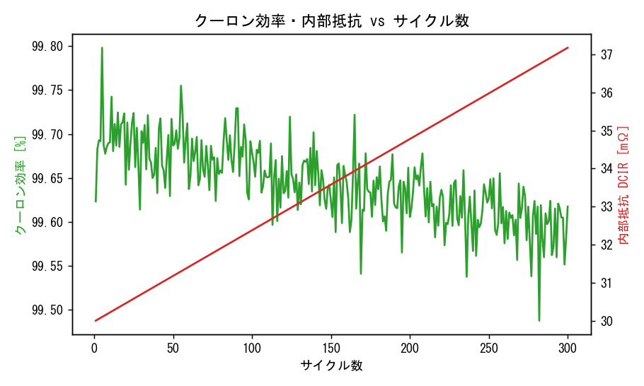

# バッテリ サイクル試験 解析レポート（自動生成）

**総合判定: ✅ PASS**

- 解析サイクル数: 300
- 初期容量: 3.004 Ah → 最終容量: 2.546 Ah
- 最終容量維持率: **84.7%**（劣化 5.09%/100cyc）
- 平均クーロン効率: 99.64%
- 内部抵抗(終): 37.2 mΩ

## 規格合否

| 項目 | 測定 | 規格 | 判定 |
|---|---|---|---|
| 最終容量維持率 | 84.7% (cycle 300) | >= 80.0% | ✅ |
| 平均クーロン効率 | 99.64% | >= 99.0% | ✅ |
| 内部抵抗(終) | 37.2 mΩ | <= 45.0 mΩ | ✅ |

## グラフ

---
*simulate_cycles() を充放電試験機の出力CSV読み込みに差し替えると実データ解析になります。*